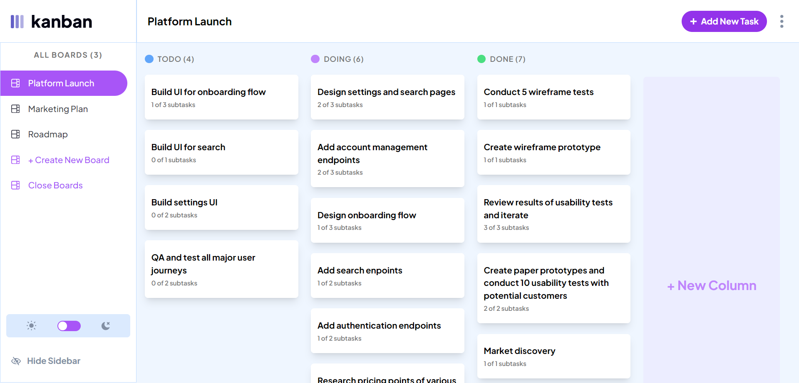

# Kanban Task Management

## Table of contents

- [Overview](#overview)
  - [The challenge](#the-challenge)
  - [Screenshot](#screenshot)
  - [Links](#links)
- [My process](#my-process)
  - [Built with](#built-with)
  - [What I learned](#what-i-learned)
- [Author](#author)

## Overview

### The challenge

Users should be able to:

- View the optimal layout for the app depending on their device's screen size
- See hover states for all interactive elements on the page
- Create, read, update, and delete boards and tasks
- Receive form validations when trying to create/edit boards and tasks
- Mark subtasks as complete and move tasks between columns
- Hide/show the board sidebar
- Toggle the theme between light/dark modes
- **Bonus**: Allow users to drag and drop tasks to change their status and re-order them in a column
- **Bonus**: Keep track of any changes, even after refreshing the browser (`localStorage` could be used for this if you're not building out a full-stack app)

### Screenshot

### Links

- Solution URL: [akshat-1290/kanban-task-managment](https://github.com/Akshat-1290/kanban-task-management)
- Live Site URL: [Kanban task management web app](https://kanban-task-management-beryl.vercel.app)

## My process

### Built with

- [Vite](https://vitejs.dev/)
- [React](https://reactjs.org/) - JS library
- [React Router](https://reactrouter.com/en/main)
- [Tailwind CSS](https://tailwindcss.com/)
- [Typescript](https://www.typescriptlang.org/)

### What I learned/ How I made it

I have learned about routing and state management a lot in this project. For managing the state i have use the combination of useReducer and useContext. For persisting the data across browser refresh i have used local forage database. I learned about action , loaders , context , reducer. I have made a responsive design supporting all types of devices. The inspiration i took for code was from [david-tajeda](https://davidtejada.dev/), i read his code and that helped me a lot in building this website. I have tried my best to do the best practice. This project took more time than i thought there was a lot of modals and cases that have to be handled.I will be improving this project in future.

## Author

- Website - [Akshat Sharma](https://github.com/Akshat-1290)
